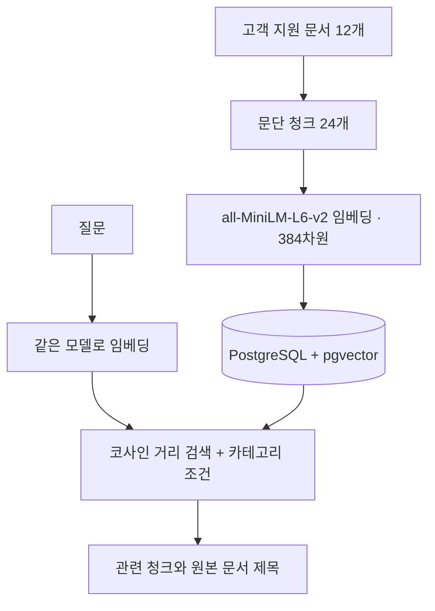
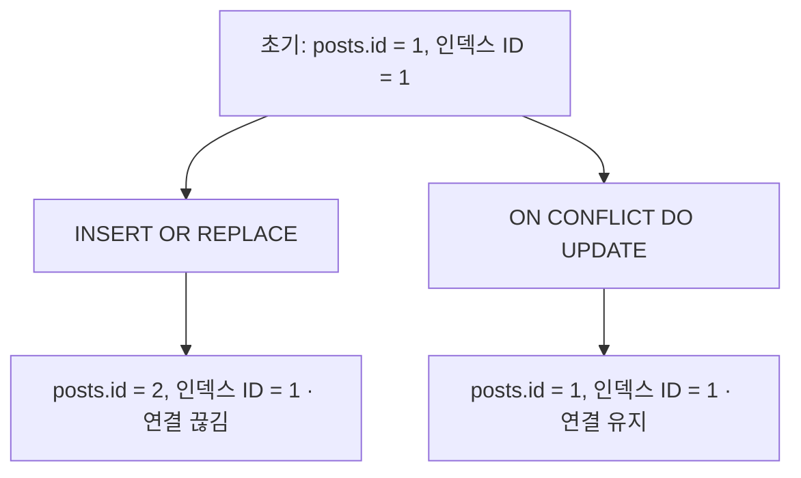

# vector-search-experiments

『벡터 데이터베이스』 3~5장에서 다루는 검색 문제를 FAISS, SQLite, PostgreSQL/pgvector로 각각 확인한 실험입니다. 근사 검색의 재현율과 시간, 원본과 인덱스의 ID 연결, 문장 임베딩을 이용한 의미 검색을 실행 가능한 코드와 원본 출력으로 기록했습니다.

## 핵심 결과

| 실험 | 데이터와 방법 | 확인한 결과 |
|---|---|---|
| FAISS | 난수 벡터 10,000개(64차원), 질의 100개 | IVF `nprobe=1`의 recall@5는 0.078, `nprobe=100`은 1.000. 질의 시간은 0.0132ms에서 0.1862ms로 증가 |
| SQLite | 원본 테이블과 인덱스 ID를 대신하는 일반 테이블 | `INSERT OR REPLACE` 후 원본 ID는 1→2, 인덱스 ID는 1에 남음. UPSERT는 ID 1을 유지 |
| pgvector | 직접 작성한 고객 지원 문서 12개, 청크 24개 | 엄격한 키워드 비교가 0건인 두 질문에서 관련 청크를 벡터 검색 상위에 반환 |

FAISS 지연 시간은 이 PC에서 한 번 실행해 얻은 값입니다. 장비 상태와 데이터에 따라 달라지며, 서비스 성능을 대표하지 않습니다. 전체 출력은 각 실험 아래에 연결했습니다.

수치를 확인하려면 아래 **실행 방법의 명령**을 같은 순서로 실행하고, 각 절의 원본 출력과 비교하면 됩니다. FAISS 로그에는 라이브러리 버전·난수 시드·벡터 수·측정 방식이, SQLite 로그에는 확장 대신 사용한 대역 테이블과 ID 변화가, pgvector 로그에는 질문·필터·키워드 건수·상위 청크가 남아 있습니다. 표와 다이어그램은 이 출력을 읽기 쉽게 정리한 것이며, 검색 관련성을 평가하는 정답 데이터셋은 아직 없습니다.

## 실험 구성

세 실험은 서로 독립적입니다. pgvector 실험의 문서 검색 경로는 다음과 같습니다.



책 5장의 논문 검색 구조를 작은 고객 지원 문서로 축소한 **의미 검색** 실험입니다. LLM 답변 생성은 포함하지 않습니다. 더 큰 논문 검색 구현은 [pgvector-arxiv-search](https://github.com/iohyeon/pgvector-arxiv-search)에 있습니다.

## 실행 방법

필요한 것: Docker, Python 3.11, [uv](https://docs.astral.sh/uv/). 첫 실행에서는 임베딩 모델 파일을 내려받습니다. 명령은 저장소 루트에서 실행합니다.

```bash
uv venv --python 3.11 .venv
uv pip install --python .venv/bin/python -r requirements.txt
docker compose up -d --wait
.venv/bin/python experiments/pgvector_search.py demo
.venv/bin/python experiments/faiss_recall.py
.venv/bin/python experiments/sqlite_rowid.py
```

질문과 카테고리를 바꿔 검색하려면 다음 명령을 사용합니다.

```bash
.venv/bin/python experiments/pgvector_search.py search \
  --query "Where can I get a receipt for my order?" \
  --category billing
```

PostgreSQL은 `127.0.0.1:55443`에만 열립니다. `compose.yaml`의 계정은 로컬 실습용입니다. `demo`는 전용 DB의 예제 문서를 다시 색인합니다. 종료할 때는 `docker compose down`을 실행합니다.

## FAISS: 속도와 재현율

[실험 코드](experiments/faiss_recall.py) · [원본 실행 출력](results/faiss_terminal.txt)

Flat의 상위 5개를 정답으로 놓고 IVF와 HNSW의 `recall@5`를 계산했습니다. 질의 시간은 CPU 스레드 하나에서 단일 질문을 처리한 시간을 세 번 측정한 중앙값입니다.

| 설정 | recall@5 | 질의당 시간 |
|---|---:|---:|
| Flat 정확 검색 | 1.000 | 0.1549ms |
| IVF `nprobe=1` | 0.078 | 0.0132ms |
| IVF `nprobe=16` | 0.574 | 0.0406ms |
| IVF `nprobe=100` | 1.000 | 0.1862ms |
| HNSW `efSearch=8` | 0.380 | 0.0275ms |
| HNSW `efSearch=128` | 0.952 | 0.1673ms |

탐색 범위를 넓히면 재현율과 처리 시간이 함께 올랐습니다. 이 규모에서는 높은 재현율로 설정한 HNSW가 Flat보다 빠르지 않았습니다. 입력은 **실제 문장 임베딩이 아닌 균등 난수 벡터**이므로, 검색 품질과 서비스 지연을 판단하려면 실제 데이터로 다시 측정해야 합니다.

## SQLite: 원본과 인덱스의 ID 연결

[실험 코드](experiments/sqlite_rowid.py) · [원본 실행 출력](results/sqlite_terminal.txt)



책 4장의 `posts`와 `posts_vss` 연결 문제를 일반 SQLite 테이블 두 개로 최소 재현했습니다. `vector_index`는 인덱스 ID만 보여 주는 대역 테이블입니다. **`sqlite-vss` 확장이나 벡터 검색은 실행하지 않았습니다.** 실제 시스템에서는 원본과 인덱스를 같은 트랜잭션에서 갱신해야 합니다.

## pgvector: 표현이 달라도 관련 문서를 찾는가

[실험 코드](experiments/pgvector_search.py) · [원본 실행 출력](results/pgvector_terminal.txt) · [DB 확인 출력](results/database_check.txt) · [예제 문서](data/support_articles.json)

FastEmbed의 ONNX 실행기로 `all-MiniLM-L6-v2` 모델을 사용해 문서와 질문을 같은 384차원 공간에 임베딩했습니다. `vector(384)` 컬럼을 코사인 거리로 정렬하고 카테고리는 같은 SQL의 `WHERE` 조건으로 처리합니다. 실행 당시 pgvector 버전은 0.8.7이었습니다.

| 질문 | 키워드 비교 | 벡터 검색 상위 결과 |
|---|---|---|
| `I want my money back.` | 0건 | `Check refund status` 0.388, `Refund policy` 0.379, `Damaged item on arrival` 0.348 |
| `Where can I get a receipt for my order?` + `billing` 필터 | 0건 | `Download an invoice`의 두 청크 0.557, 0.514 |

키워드 기준은 `plainto_tsquery('english', ...)`로 입력 단어를 모두 요구하는 비교입니다. 모든 키워드 검색 방식이 실패한다는 뜻은 아닙니다. 코사인 점수도 정답 확률이 아닙니다. 두 번째 질문처럼 같은 문서의 청크가 여러 번 나올 수 있어, 사용자에게 문서 목록을 보여 줄 때는 문서 ID별로 결과를 묶어야 합니다.

24청크에서는 ANN 인덱스를 만들지 않았습니다. 이 규모에서는 모든 청크를 비교하는 정확 검색을 사용했고, 데이터가 커지면 실행 계획과 검색 재현율을 함께 보며 HNSW를 검토해야 합니다.
