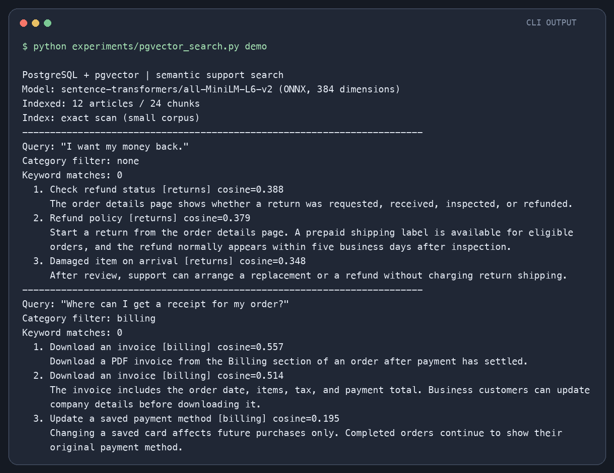
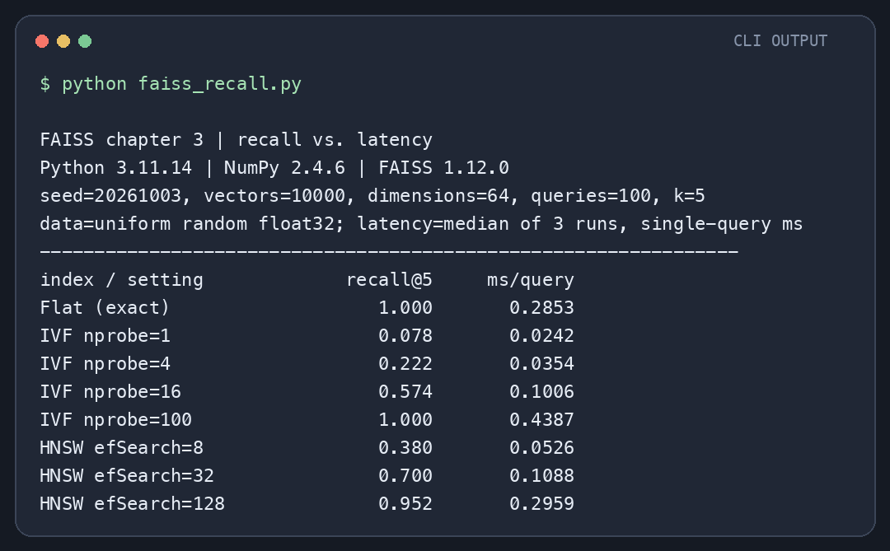
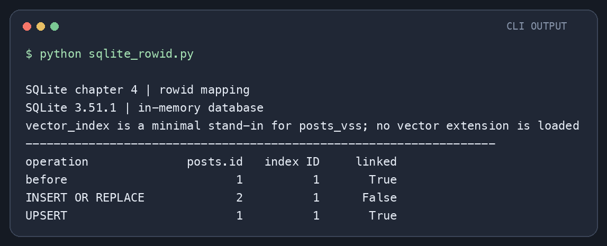

# 『벡터 데이터베이스』 실습: FAISS에서 pgvector 검색까지

『벡터 데이터베이스』를 읽고 **벡터 검색의 정확도·속도 교환 관계**, **원본과 인덱스의 ID 연결**, **실제 문장 임베딩을 저장한 의미 검색**을 CLI에서 확인한 기록입니다. 책의 코드를 통째로 복제하지 않고, 세 가지 질문을 작은 실행 예제로 재구성했습니다.

1. 근사 검색을 빠르게 하면 정확한 이웃을 얼마나 놓치는가?
2. 원본 행의 ID가 바뀌면 검색 인덱스와의 연결은 어떻게 되는가?
3. 질문과 문서의 단어가 달라도 관련 문서를 찾을 수 있는가?

## 실행한 시스템

```text
직접 작성한 고객 지원 문서 12개
        ↓ 문단 단위로 분리
텍스트 청크 24개
        ↓ all-MiniLM-L6-v2 임베딩 (384차원)
PostgreSQL + pgvector
        ↓ 코사인 거리 검색 + SQL 카테고리 필터
관련 청크와 원본 문서 제목 반환
```

**범위:** 이것은 5장의 논문 검색 구조를 축소한 **의미 검색 실습**입니다. LLM 답변 생성까지 하는 RAG 시스템은 아닙니다. 공개 저장소에 넣을 수 있도록 자료는 모두 이 실습용으로 직접 작성했습니다. 책 본문·개인 메모·실제 고객 데이터는 포함하지 않았습니다.

| 실습 | 책과 연결되는 지점 | 확인한 것 |
|---|---|---|
| [FAISS 비교](experiments/faiss_recall.py) | 3장 인덱스와 ANN | 탐색 범위에 따른 recall@5·질의 시간 |
| [SQLite ID 연결](experiments/sqlite_rowid.py) | 4장 이중 테이블 구조 | `INSERT OR REPLACE`와 UPSERT의 ID 차이 |
| [pgvector 의미 검색](experiments/pgvector_search.py) | 5장 PostgreSQL 검색 | 실제 임베딩 저장·코사인 검색·메타데이터 필터 |

## 직접 실행하기

필요한 것: **Docker**, **Python 3.11**, [uv](https://docs.astral.sh/uv/). 아래 명령은 저장소 루트에서 실행합니다. 처음 실행할 때 임베딩 모델 파일 약 90MB를 받습니다. Docker 이미지는 `pgvector/pgvector:pg15`입니다.

```bash
uv venv --python 3.11 .venv
uv pip install --python .venv/bin/python -r requirements.txt
docker compose up -d --wait
.venv/bin/python experiments/pgvector_search.py demo
```

질문과 카테고리를 바꿔 검색할 수도 있습니다.

```bash
.venv/bin/python experiments/pgvector_search.py search \
  --query "Where can I get a receipt for my order?" \
  --category billing
```

나머지 두 실습은 DB 서버 없이 실행됩니다.

```bash
.venv/bin/python experiments/faiss_recall.py
.venv/bin/python experiments/sqlite_rowid.py
```

PostgreSQL 컨테이너는 **127.0.0.1:55443**에만 열립니다. `compose.yaml`의 계정과 비밀번호는 이 로컬 실습 전용입니다. 실행 후 컨테이너를 중지하려면 `docker compose down`을 사용합니다. 데이터 볼륨은 남으므로 다음 실행에서 다시 사용할 수 있습니다. `demo` 명령은 이 전용 DB의 예제 문서를 다시 색인해 같은 상태로 만듭니다.

## pgvector 검색 결과

사용한 모델은 책에도 등장하는 `sentence-transformers/all-MiniLM-L6-v2`입니다. 이 저장소에서는 가벼운 ONNX 실행기인 FastEmbed로 같은 384차원 모델을 사용했습니다. 문서 제목과 문단을 임베딩해 `vector(384)` 컬럼에 저장하고, 질문도 같은 모델로 임베딩했습니다. PostgreSQL에서 `embedding <=> query_vector`로 코사인 거리를 정렬했습니다. 카테고리는 같은 SQL의 `WHERE` 조건으로 처리합니다.



[원본 CLI 출력](results/pgvector_terminal.txt) · [DB 확인 출력](results/database_check.txt) · [예제 문서](data/support_articles.json)

실행 환경에서 확인한 DB 상태는 `pgvector 0.8.7`, 문서 **12개**, 청크 **24개**였습니다.

| 질문 | 키워드 검색 | pgvector 상위 결과 |
|---|---|---|
| `I want my money back.` | 0건 | `Check refund status` 0.388, `Refund policy` 0.379, `Damaged item on arrival` 0.348 |
| `Where can I get a receipt for my order?` + `billing` 필터 | 0건 | `Download an invoice` 0.557, 같은 문서의 다른 청크 0.514 |

키워드 기준은 PostgreSQL `plainto_tsquery('english', ...)`의 **모든 단어를 요구하는 방식**입니다. 따라서 0건이라는 결과는 이 비교 방식의 결과이지, 모든 키워드 검색 방식이 실패한다는 뜻은 아닙니다. 벡터 검색은 질문의 `money back`과 문서의 `refund`, 질문의 `receipt`와 문서의 `invoice`처럼 표현이 다른 경우에도 관련 문서를 상위에 올렸습니다.

한 문서의 두 청크가 상위에 함께 나온 점도 관찰할 수 있습니다. 사용자 화면에서 문서 목록을 보여 주려면 `article_id`별로 결과를 묶고 대표 점수를 정해야 합니다. 이 실습은 검색된 **청크**를 그대로 보여 주어 그 차이를 드러냈습니다. 코사인 점수 0.557은 ‘55.7% 정답’이라는 확률이 아니며, 모델이나 자료가 바뀌면 고정 임곗값으로 해석하기 어렵습니다.

문서가 24청크뿐이라 pgvector에는 HNSW 인덱스를 만들지 않았습니다. 전체를 비교하는 정확 검색이 이 규모에 맞습니다. 데이터가 커지면 `EXPLAIN`과 검색 재현율을 함께 확인하며 ANN 인덱스를 검토해야 합니다.

## FAISS: 빠른 검색과 놓친 정답

3장의 FAISS 예제를 바탕으로, 균등 난수 `float32` 벡터 **1만 개(64차원)**와 질문 **100개**를 만들었습니다. 모든 벡터를 비교하는 Flat의 상위 5개를 정답으로 놓고 `recall@5`를 계산했습니다. 지연 시간은 CPU 스레드 하나에서 단일 질문을 처리한 시간을 3회 측정한 중앙값입니다.



[원본 CLI 출력](results/faiss_terminal.txt)

| 설정 | recall@5 | 질의당 시간 |
|---|---:|---:|
| Flat 정확 검색 | 1.000 | 0.2853ms |
| IVF `nprobe=1` | 0.078 | 0.0242ms |
| IVF `nprobe=16` | 0.574 | 0.1006ms |
| IVF `nprobe=100` | 1.000 | 0.4387ms |
| HNSW `efSearch=8` | 0.380 | 0.0526ms |
| HNSW `efSearch=128` | 0.952 | 0.2959ms |

탐색 범위를 넓히면 재현율이 오르지만 시간도 늘었습니다. 이 실행에서는 재현율을 높인 HNSW가 Flat보다 빠르지 않았습니다. 작은 데이터에서 ANN이 반드시 이득이라는 뜻은 아니라는 점을 보여 줍니다. 다만 **균등 난수 벡터는 실제 문장 임베딩이 아니며**, 질의 시간은 장비 상태에 따라 달라집니다. 서비스용 결론은 실제 데이터와 질문으로 다시 측정해야 합니다.

## SQLite: 원본과 인덱스의 ID 연결

4장의 `posts`–`posts_vss` 연결 문제를 두 개의 일반 SQLite 테이블로 **최소 재현**했습니다. 벡터 확장은 설치하지 않았고 유사도 검색도 실행하지 않았습니다. `vector_index`는 인덱스 쪽 ID만 보여 주는 대역 테이블입니다.



[원본 CLI 출력](results/sqlite_terminal.txt)

같은 `post_id`에 `INSERT OR REPLACE`를 사용하자 원본 ID는 1에서 2로 바뀌고 인덱스 ID는 1에 남았습니다. `ON CONFLICT DO UPDATE`를 사용하면 원본 ID가 유지됩니다. 실제 시스템에서는 원본과 벡터 인덱스 갱신을 같은 트랜잭션으로 묶어 연결을 지켜야 합니다.

## 블로그에 옮길 내용

[실습 후기 초안](blog/서평에 넣을 실습 후기.md)에 실행 환경, 실제 결과, 예상과 달랐던 점, 남은 과제를 1인칭 서평 문체로 정리했습니다.

## 결과 이미지에 관하여

`results/*.png`는 **실제 CLI 출력을 저장한 텍스트 파일을 읽어 이미지로 렌더링**한 것입니다. 운영체제 터미널 창을 촬영한 스크린샷은 아닙니다. 긴 줄은 이미지에서만 읽기 좋게 접었고, 수정되지 않은 원본 출력도 함께 저장했습니다.
